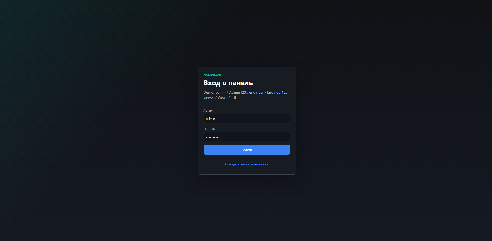
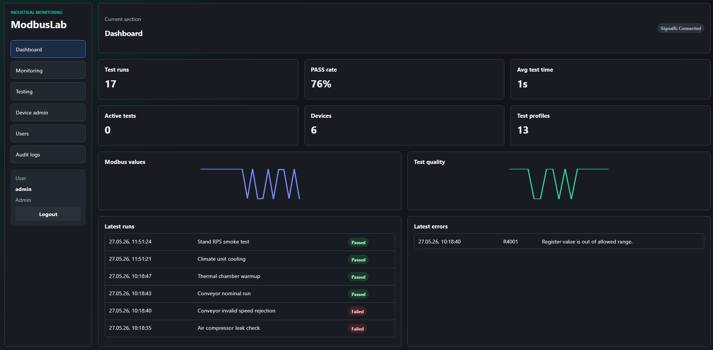
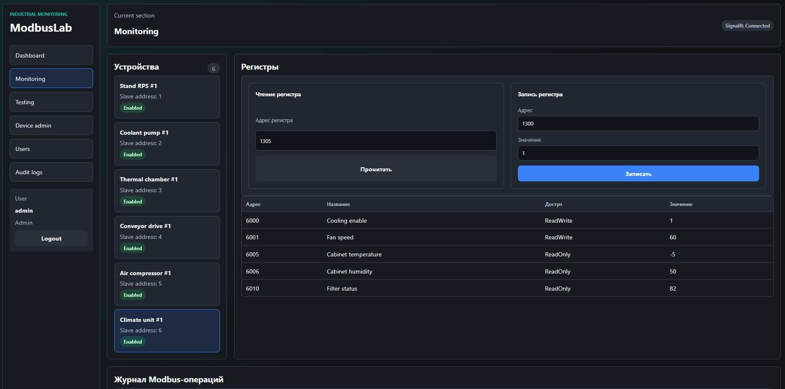
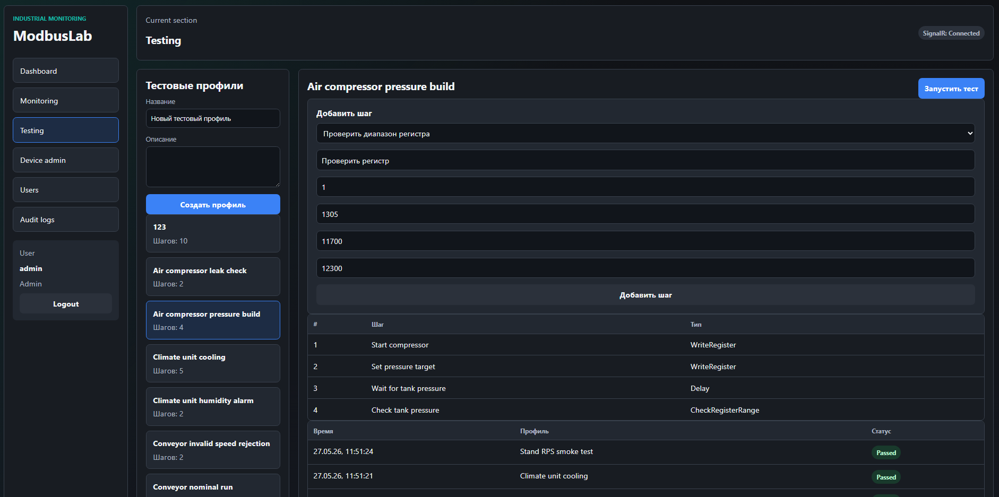
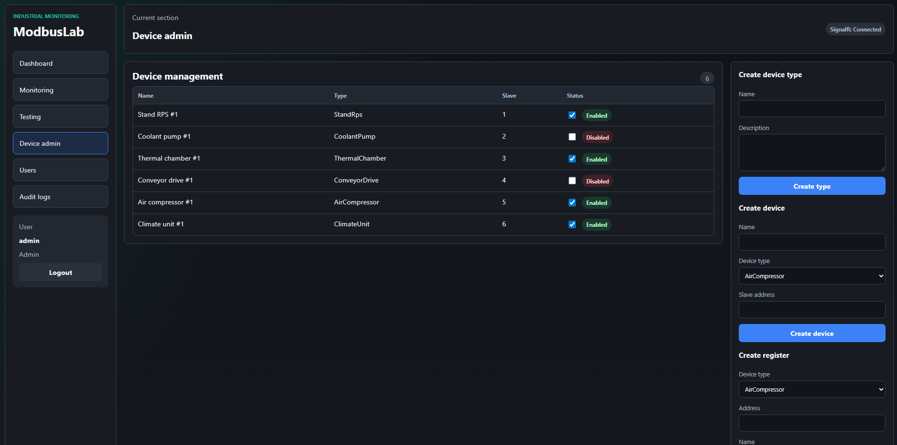
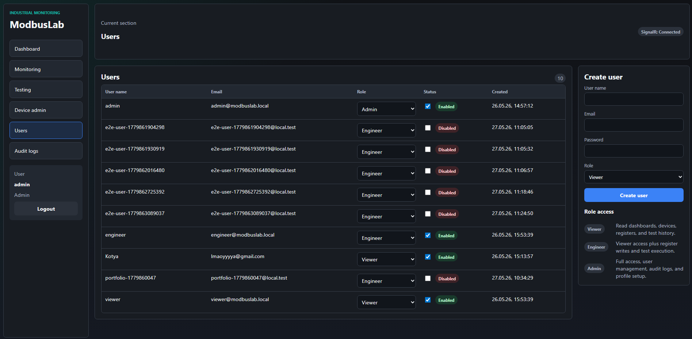
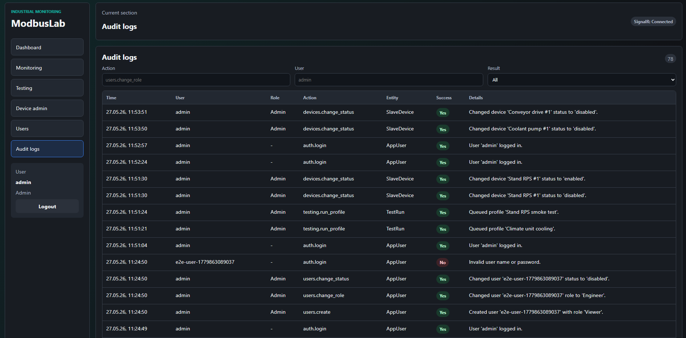

# ModbusLab

[English](README.md) | Русский

[](https://github.com/kotyasmol/ModbusLab/actions/workflows/ci.yml)

ModbusLab это fullstack-приложение для промышленного мониторинга и автоматизации тестирования. Проект имитирует лабораторию устройств с Modbus-подобной моделью работы: защищённые операции, ролевая модель доступа, хранение данных в PostgreSQL, обновление регистров в реальном времени, аудит действий, администрирование устройств, администрирование пользователей и операторская панель.

Проект сделан как портфолио-ready продуктовый срез: backend API, frontend UI, миграции базы данных, Docker Compose, CI-проверки, backend-тесты и Playwright E2E-покрытие.

## Скриншоты

### Вход в систему



### Панель управления



### Мониторинг устройств



### Автоматизация тестирования



### Администрирование устройств



### Администрирование пользователей



### Журнал аудита



## Зачем нужен этот проект

Промышленные устройства часто проверяются вручную: оператор читает регистры, записывает управляющие значения, сравнивает измерения с допустимыми диапазонами, запускает отдельные тестовые операции и фиксирует результат. Такой подход медленный, плохо масштабируется и легко ломается из-за человеческого фактора.

ModbusLab переносит этот процесс в web-платформу:

- мониторинг имитированных slave-устройств и их регистров;
- чтение и запись значений регистров с проверкой прав доступа;
- запуск повторяемых тестовых сценариев;
- отслеживание прогресса выполнения тестов в реальном времени;
- просмотр успешных и неуспешных шагов тестирования;
- экспорт отчётов по тестовым запускам;
- аудит действий пользователей;
- управление пользователями, ролями, устройствами, типами устройств и определениями регистров.

## Что демонстрирует проект

Этот репозиторий — не просто frontend-макет. Он включает полноценный вертикальный срез приложения, приближенного к production-подходу:

- React + TypeScript frontend с защищёнными страницами и интерфейсом, зависящим от роли пользователя;
- ASP.NET Core backend с Minimal API endpoints;
- PostgreSQL база данных с миграциями Entity Framework Core;
- JWT-аутентификация и политики авторизации;
- обновления в реальном времени через SignalR;
- фоновые worker-сервисы для имитации изменения регистров и очереди выполнения тестов;
- Docker Compose для локального запуска;
- автоматические CI-проверки;
- backend unit-тесты и браузерные E2E-тесты.

## Основной функционал

### Аутентификация и RBAC

- JWT-аутентификация.
- Локальные пользователи с хешированными паролями.
- Роли: `Viewer`, `Engineer`, `Admin`.
- Защищённые frontend-страницы и навигация с учётом роли.
- Поддержка Bearer-аутентификации в Swagger.
- Публичная регистрация управляется через конфигурацию.
- Rate limiting для входа и регистрации.
- Правила безопасности:
  - отключённые пользователи не могут войти в систему;
  - последнего активного администратора нельзя отключить или понизить в роли;
  - администратор не может отключить собственную учётную запись.

### Администрирование пользователей

Пользователи с ролью Admin могут:

- просматривать список пользователей;
- создавать новых пользователей;
- изменять роли пользователей;
- включать и отключать учётные записи;
- просматривать связанные с пользователями действия через журнал аудита.

### Администрирование устройств

Пользователи с ролями Engineer/Admin могут:

- создавать типы устройств;
- создавать slave-устройства с уникальными Modbus slave-адресами;
- включать и отключать устройства;
- создавать определения регистров для типа устройства;
- инициализировать значения регистров для уже существующих устройств этого типа.

### Мониторинг устройств

- Несколько заранее созданных demo-устройств.
- Определения регистров с режимами доступа и допустимыми диапазонами.
- Операции чтения и записи регистров.
- Проверка прав доступа для операций записи.
- Журнал Modbus-операций.
- Обновление значений регистров в реальном времени через SignalR.

### Автоматизация тестирования

- Тестовые профили с упорядоченными шагами.
- Поддерживаемые типы шагов:
  - запись регистра;
  - задержка;
  - проверка значения регистра на попадание в диапазон.
- Успешные и намеренно падающие demo-сценарии.
- Очередь выполнения тестов в фоновом режиме.
- Прогресс выполнения теста в реальном времени через SignalR.
- История тестовых запусков.
- Экспорт отчёта в CSV.

### Аудит и диагностика

- Журнал аудита для аутентификации, управления пользователями, записи регистров, управления устройствами и действий, связанных с тестированием.
- Фильтрация аудита по действию, пользователю, результату и диапазону дат в API.
- Health endpoints для API и базы данных.
- Docker healthchecks для PostgreSQL, API и frontend.

## Страницы приложения

| Страница | Назначение | Типичный доступ |
| --- | --- | --- |
| Login | Вход в систему или переход к регистрации | Public |
| Dashboard | Общий обзор устройств, последних логов, профилей и тестовых запусков | Viewer / Engineer / Admin |
| Monitoring | Значения регистров, операции чтения/записи и Modbus-журнал | Viewer может читать, Engineer/Admin могут записывать |
| Testing | Тестовые профили, запуск тестов, прогресс, история и CSV-отчёты | Engineer / Admin |
| Device Admin | Типы устройств, устройства, определения регистров и статус устройств | Engineer / Admin |
| Users | Создание пользователей, изменение ролей и управление статусом аккаунтов | Admin |
| Audit Logs | История действий безопасности и бизнес-операций | Admin |

## Технологический стек

### Backend

- .NET 10
- ASP.NET Core Minimal API
- Entity Framework Core
- PostgreSQL
- SignalR
- JWT Bearer Authentication
- xUnit

### Frontend

- React
- TypeScript
- Vite
- TanStack Query
- SignalR Client
- Playwright
- Custom CSS

### Инфраструктура

- Docker Compose
- PostgreSQL 17
- GitHub Actions
- Swagger / OpenAPI

## Архитектура

```text
React + TypeScript UI
        |
        | HTTP + JWT / SignalR
        v
ASP.NET Core Minimal API
        |
        | Application services
        v
Domain entities and business rules
        |
        | EF Core repositories
        v
PostgreSQL
```

Структура репозитория:

```text
src/
  ModbusLab.Api/             HTTP API, auth, endpoints, SignalR, background services
  ModbusLab.Application/     Application services and use cases
  ModbusLab.Domain/          Domain entities and business rules
  ModbusLab.Infrastructure/  EF Core, PostgreSQL, repositories, migrations

tests/
  ModbusLab.Tests/           Backend unit tests

frontend/
  src/                       React application
  e2e/                       Playwright E2E tests

```

## Demo-аккаунты

Эти аккаунты предназначены только для локальной разработки.

| Login | Password | Role | Access |
| --- | --- | --- | --- |
| `admin` | `Admin123!` | `Admin` | Полный доступ, пользователи, аудит, управление устройствами, управление тестовыми профилями |
| `engineer` | `Engineer123!` | `Engineer` | Мониторинг, запись регистров, запуск тестов, управление устройствами |
| `viewer` | `Viewer123!` | `Viewer` | Только чтение мониторинга и истории |

## Быстрый запуск через Docker

Сборка и запуск PostgreSQL, API и frontend:

```powershell
docker compose up --build
```

Адреса по умолчанию:

| Сервис | URL |
| --- | --- |
| Frontend | `http://localhost:5173` |
| Swagger | `http://localhost:8080/swagger` |
| API health | `http://localhost:8080/api/health` |
| Database health | `http://localhost:8080/api/health/db` |
| PostgreSQL | `localhost:5433` |

Остановить контейнеры:

```powershell
docker compose down
```

Сбросить локальный volume базы данных:

```powershell
docker compose down -v
```

## Локальная разработка

Запустить только PostgreSQL:

```powershell
docker compose up -d postgres
```

Запустить API:

```powershell
dotnet restore
dotnet run --project src/ModbusLab.Api
```

Запустить frontend:

```powershell
npm install --prefix frontend
npm run dev --prefix frontend
```

## Проверки качества

Backend:

```powershell
dotnet restore
dotnet build
dotnet test
```

Frontend:

```powershell
npm install --prefix frontend
npm run build --prefix frontend
npm run lint --prefix frontend
```

E2E:

```powershell
npm run e2e --prefix frontend
```

Docker:

```powershell
docker compose config
docker compose build
```

GitHub Actions запускает backend-, frontend-, Docker- и Playwright E2E-проверки при push и pull request в ветку `main`.

## Важные API endpoints

| Method | Endpoint | Description |
| --- | --- | --- |
| `POST` | `/api/auth/login` | Вход в систему и получение JWT |
| `POST` | `/api/auth/register` | Публичная регистрация, если она включена |
| `GET` | `/api/auth/me` | Текущий аутентифицированный пользователь |
| `GET` | `/api/users` | Список пользователей для Admin |
| `POST` | `/api/users` | Создание пользователя администратором |
| `PATCH` | `/api/users/{userId}/role` | Изменение роли пользователя администратором |
| `PATCH` | `/api/users/{userId}/status` | Включение или отключение пользователя администратором |
| `GET` | `/api/devices` | Список устройств |
| `GET` | `/api/devices/{deviceId}/registers` | Регистры устройства |
| `GET` | `/api/device-management/types` | Список типов устройств |
| `POST` | `/api/device-management/types` | Создание типа устройства |
| `POST` | `/api/device-management/devices` | Создание slave-устройства |
| `PATCH` | `/api/device-management/devices/{deviceId}/status` | Включение или отключение устройства |
| `POST` | `/api/device-management/registers` | Создание определения регистра |
| `POST` | `/api/modbus/read` | Чтение регистра |
| `POST` | `/api/modbus/write` | Запись регистра |
| `GET` | `/api/modbus/logs` | Журнал Modbus-операций |
| `GET` | `/api/test-profiles` | Тестовые профили |
| `POST` | `/api/test-profiles` | Создание тестового профиля |
| `POST` | `/api/test-profiles/{profileId}/run` | Запуск тестового профиля |
| `GET` | `/api/test-runs` | Последние тестовые запуски |
| `GET` | `/api/test-runs/{runId}/report.csv` | Экспорт CSV-отчёта |
| `GET` | `/api/audit-logs` | Отфильтрованный журнал аудита |
| `GET` | `/api/health` | Проверка состояния API |
| `GET` | `/api/health/db` | Проверка состояния базы данных |
| `GET` | `/hubs/modbus` | SignalR hub для обновлений в реальном времени |


## Roadmap

- Refresh tokens и управление активными сессиями.
- Редактирование и удаление типов устройств, slave-устройств и регистров.
- OpenTelemetry traces и структурированное логирование запросов.
- Более подробная аналитика на dashboard.
- PDF-отчёты по тестам.
- Интеграционные тесты с PostgreSQL.
- Реальный Modbus RTU/TCP adapter за текущими контрактами application services.
