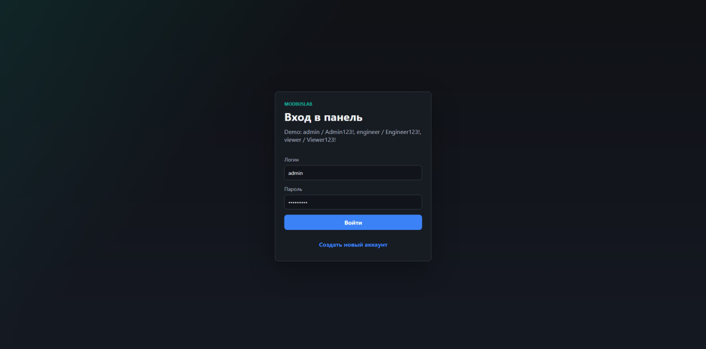
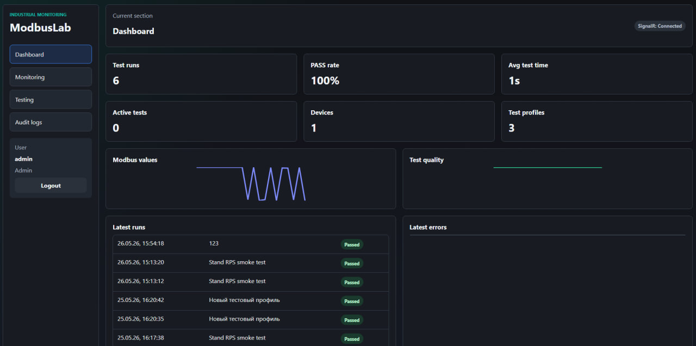
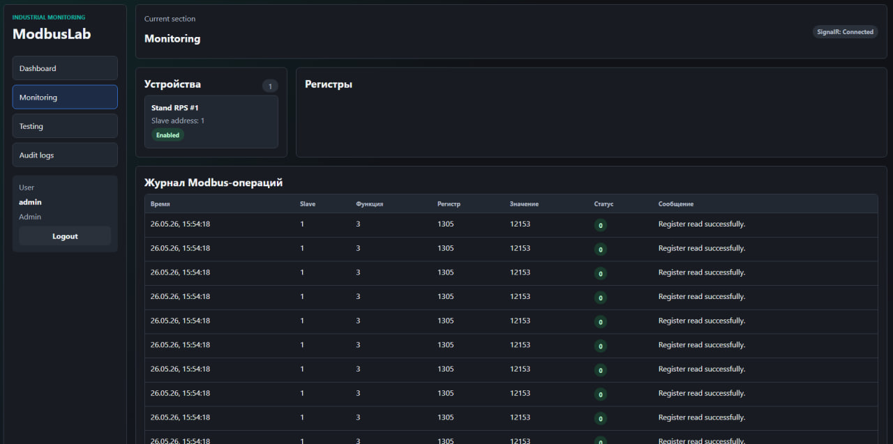
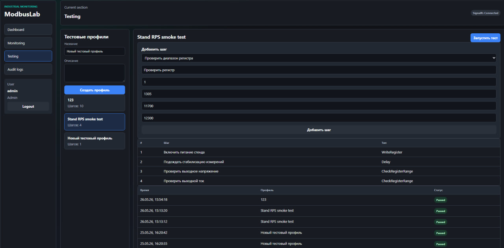
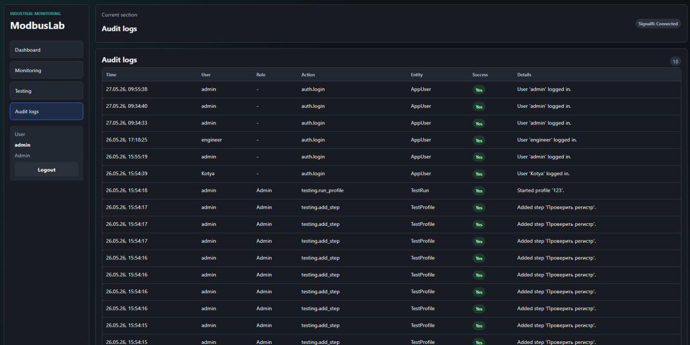

# ModbusLab


ModbusLab это fullstack pet-проект в промышленной тематике для мониторинга, симуляции и автоматизированного тестирования Modbus-like устройств.

Проект показывает не просто CRUD-приложение, а компактную production-style систему: защищённый backend, авторизация, роли пользователей, PostgreSQL, аудит действий, realtime-обновления через SignalR, React-интерфейс оператора, Docker Compose и CI.

---

## Зачем нужен проект

В промышленной разработке и производственном тестировании устройства часто проверяются вручную: оператор подключает устройство, смотрит значения регистров, записывает управляющие значения, сравнивает измерения с допустимыми диапазонами и фиксирует результат.

Такой процесс плохо масштабируется, занимает время и создаёт риск ошибок из-за человеческого фактора.

ModbusLab демонстрирует, как такую задачу можно перевести в web-платформу:

- мониторить устройства и регистры;
- выполнять чтение и запись регистров;
- запускать тестовые сценарии;
- сохранять историю запусков;
- видеть результат каждого шага;
- экспортировать отчёты;
- контролировать действия пользователей через audit log.

---

## Возможности

### Авторизация и роли

- JWT-аутентификация.
- Локальные пользователи.
- Role-based access control.
- Роли:
  - `Viewer`;
  - `Engineer`;
  - `Admin`.
- Защищённые API endpoints.
- Проверка прав на frontend.
- Swagger с поддержкой Bearer JWT.

### Мониторинг устройств

- Список Modbus slave devices.
- Таблица регистров выбранного устройства.
- Отображение текущих значений регистров.
- Чтение регистра.
- Запись регистра.
- Проверка прав доступа к регистру.
- Проверка допустимого диапазона значений.
- Журнал Modbus-операций.
- Realtime-обновления регистров через SignalR.

### Тестовые сценарии

- Тестовые профили.
- Конфигурируемые шаги теста:
  - запись регистра;
  - задержка;
  - проверка регистра на попадание в диапазон.
- Запуск тестового профиля.
- История запусков.
- Результат по каждому шагу.
- Статусы `Passed` / `Failed`.
- CSV-отчёт по запуску теста.

### Аудит и диагностика

- Audit log действий пользователей.
- Логирование входа, регистрации, записи регистров и тестовых действий.
- Health endpoint для API.
- Health endpoint для базы данных.
- PostgreSQL persistence.
- EF Core migrations.
- Backend unit tests.
- GitHub Actions для проверки backend и frontend.

---

## Демо-аккаунты

Аккаунты предназначены только для локальной разработки.

| Login | Password | Role | Возможности |
| --- | --- | --- | --- |
| `admin` | `Admin123!` | `Admin` | Полный доступ, audit logs, управление тестовыми профилями |
| `engineer` | `Engineer123!` | `Engineer` | Мониторинг, запись регистров, запуск тестов |
| `viewer` | `Viewer123!` | `Viewer` | Только просмотр мониторинга и истории |

Новые пользователи, зарегистрированные через интерфейс, получают роль `Viewer`.

---

## Технологический стек

### Backend

- .NET 10.
- ASP.NET Core Minimal API.
- Entity Framework Core.
- PostgreSQL.
- SignalR.
- JWT Bearer Authentication.
- xUnit.

### Frontend

- React.
- TypeScript.
- Vite.
- TanStack Query.
- SignalR Client.
- Custom CSS.

### Infrastructure

- Docker Compose.
- PostgreSQL 17.
- GitHub Actions.
- Swagger / OpenAPI.

---

## Архитектура

Backend разделён на несколько слоёв:

```text
src/
  ModbusLab.Api/             HTTP API, auth, endpoints, SignalR, background services
  ModbusLab.Application/     Application services and use cases
  ModbusLab.Domain/          Domain entities and business rules
  ModbusLab.Infrastructure/  EF Core, PostgreSQL, repositories, migrations

tests/
  ModbusLab.Tests/           Backend unit tests
```

Основной поток приложения:

```text
React Frontend
      |
      | HTTP + JWT
      v
ASP.NET Core Minimal API
      |
      | Application services
      v
Domain logic
      |
      | Repository interfaces
      v
EF Core + PostgreSQL
```

Realtime-обновления регистров:

```text
Background register simulator
      |
      v
SignalR Hub
      |
      v
React dashboard
```

---

## Быстрый запуск через Docker

Собрать и запустить PostgreSQL, API и frontend:

```powershell
docker compose up --build
```

Адреса после запуска:

| Service | URL |
| --- | --- |
| Frontend | `http://localhost:5173` |
| Swagger | `http://localhost:8080/swagger` |
| API health | `http://localhost:8080/api/health` |
| Database health | `http://localhost:8080/api/health/db` |
| PostgreSQL | `localhost:5433` |

Остановить контейнеры:

```powershell
docker compose down
```

Остановить контейнеры и удалить локальный volume базы:

```powershell
docker compose down -v
```

Если в `docker-compose.yml` используются profiles, запускать нужно так:

```powershell
docker compose --profile full up --build
```

---

## Локальная разработка без полного Docker-запуска

Запустить только PostgreSQL:

```powershell
docker compose up -d postgres
```

Восстановить зависимости и запустить API:

```powershell
dotnet restore
dotnet run --project src/ModbusLab.Api
```

Запустить frontend:

```powershell
cd frontend
npm install
npm run dev
```

Адреса для локальной разработки:

| Service | URL |
| --- | --- |
| Frontend | `http://localhost:5173` |
| Swagger | `http://localhost:5199/swagger` |
| API health | `http://localhost:5199/api/health` |
| Database health | `http://localhost:5199/api/health/db` |

---

## Demo flow

1. Открыть frontend.
2. Войти под пользователем `admin`.
3. Открыть Dashboard.
4. Проверить статус realtime-соединения.
5. Открыть Monitoring.
6. Выбрать устройство `Stand RPS #1`.
7. Прочитать регистр `1305`.
8. Записать значение `1` в регистр `1300`.
9. Открыть Testing.
10. Выбрать профиль `Stand RPS smoke test`.
11. Запустить тест.
12. Посмотреть результат выполнения шагов.
13. Скачать CSV-отчёт.
14. Открыть Audit Logs и проверить записанные действия.

Полезные demo-регистры:

| Register | Name | Description |
| --- | --- | --- |
| `1300` | Power control | `0` — питание выключено, `1` — питание включено |
| `1301` | Test mode | Текущий режим тестирования |
| `1305` | Output voltage | Симулированное выходное напряжение |
| `1306` | Output current | Симулированный выходной ток |
| `1310` | Error code | Симулированный код ошибки |

---

## Основные API endpoints

| Method | Endpoint | Description |
| --- | --- | --- |
| `POST` | `/api/auth/login` | Login и получение JWT |
| `POST` | `/api/auth/register` | Регистрация локального пользователя |
| `GET` | `/api/auth/me` | Получение текущего пользователя |
| `GET` | `/api/devices` | Получение списка Modbus slave devices |
| `GET` | `/api/devices/{deviceId}/registers` | Получение регистров устройства |
| `POST` | `/api/modbus/read` | Чтение регистра |
| `POST` | `/api/modbus/write` | Запись регистра |
| `GET` | `/api/modbus/logs` | Получение журнала Modbus-операций |
| `GET` | `/api/test-profiles` | Получение тестовых профилей |
| `POST` | `/api/test-profiles` | Создание тестового профиля |
| `POST` | `/api/test-profiles/{profileId}/steps` | Добавление шага теста |
| `POST` | `/api/test-profiles/{profileId}/run` | Запуск тестового профиля |
| `GET` | `/api/test-runs` | Получение последних запусков |
| `GET` | `/api/test-runs/{runId}` | Получение деталей запуска |
| `GET` | `/api/test-runs/{runId}/report.csv` | Экспорт CSV-отчёта |
| `GET` | `/api/audit-logs` | Получение audit logs |
| `GET` | `/api/health` | Проверка состояния API |
| `GET` | `/api/health/db` | Проверка состояния базы данных |

---

## Проверка качества

Backend:

```powershell
dotnet restore
dotnet build
dotnet test
```

Frontend:

```powershell
npm install --prefix frontend
npm run build --prefix frontend
npm run lint --prefix frontend
```

Проверка Docker Compose:

```powershell
docker compose config
```

GitHub Actions выполняет backend и frontend проверки при push и pull request в `main`.

---

## Screenshots


```markdown





```

---


## Roadmap

Планируемые улучшения:

- визуальный редактор тестовых профилей;
- background queue для выполнения тестов;
- live progress выполнения теста через SignalR;
- отмена запущенного теста;
- история значений регистров;
- графики напряжения и тока;
- Modbus TCP transport;
- абстракция под Modbus RTU;
- расширенное управление устройствами;
- страница управления пользователями для Admin;
- refresh token flow;
- integration tests с PostgreSQL;
- end-to-end tests через Playwright.

---

## Текущий статус

Portfolio-ready MVP.

